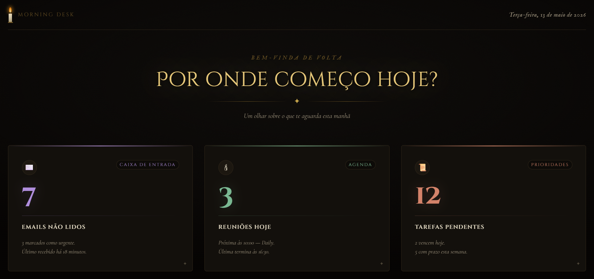

# 📊 Meu Dashboard de Dados - Vibe Coding

Este projeto foi desenvolvido durante as aulas de **Vibe Coding** da [PrograMaria](https://www.programaria.org). O objetivo é criar um dashboard interativo que consome dados de planilhas do Google e exibe visualizações dinâmicas.

## 🚀 Demonstração
Você pode acessar o projeto online aqui: https://robertairds.github.io/my-google-dashboard/

## 🛠️ Tecnologias Utilizadas
* **HTML5 / CSS3** - Estrutura e estilização.
* **JavaScript** - Lógica e consumo de APIs.
* **Google Cloud Platform** - Autenticação OAuth 2.0.
* **Google Sheets API** - Fonte de dados.

## ⚙️ Como funciona
O dashboard solicita login via conta Google e, após a permissão, lê os dados diretamente de uma planilha autorizada, gerando gráficos e tabelas automaticamente.

---
Feito com 💜 por Roberta Rodrigues durante a jornada PrograMaria.
