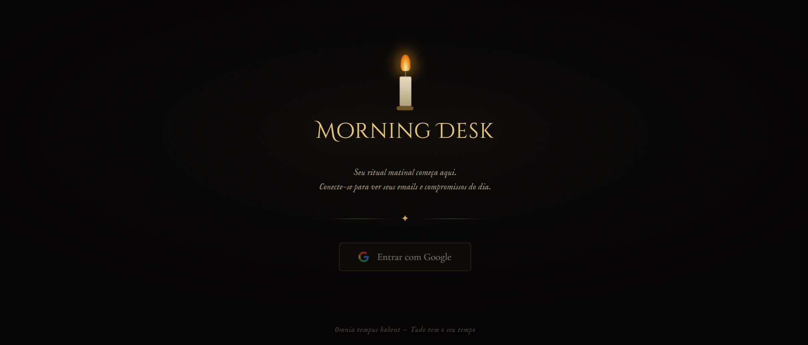

# 📊 My Data Dashboard - Vibe Coding

This project was developed during the **Vibe Coding** sessions with [PrograMaria](https://www.programaria.org). The main goal is to build an interactive dashboard that consumes data from Google Sheets and displays dynamic visualizations.

## 🚀 Live Demo
You can check out the live project here: https://robertairds.github.io/my-google-dashboard/

## 📌 Notes
- The dashboard was designed for educational and portfolio purposes.

## 📸 Preview

## 🛠️ Technologies Used
* **HTML5 / CSS3** - Structure and styling.
* **JavaScript** - Logic and API consumption.
* **Google Cloud Platform** - OAuth 2.0 Authentication.
* **Google Sheets API** - Data source.

## ⚙️ How it Works
The dashboard requests a login via Google Account. Once authorized, it fetches data directly from a specific spreadsheet and generates charts and tables automatically using JavaScript.

## 📚 About the Course
This project is part of a "Vibe Coding" journey, focusing on practical learning, diverse representation in tech, and creative development.

---
Built by Roberta Rodrigues during the PrograMaria journey.
